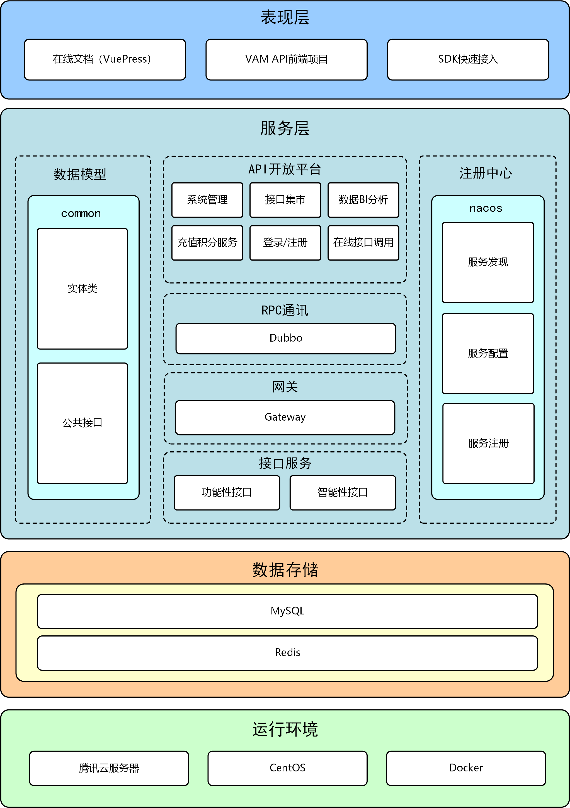
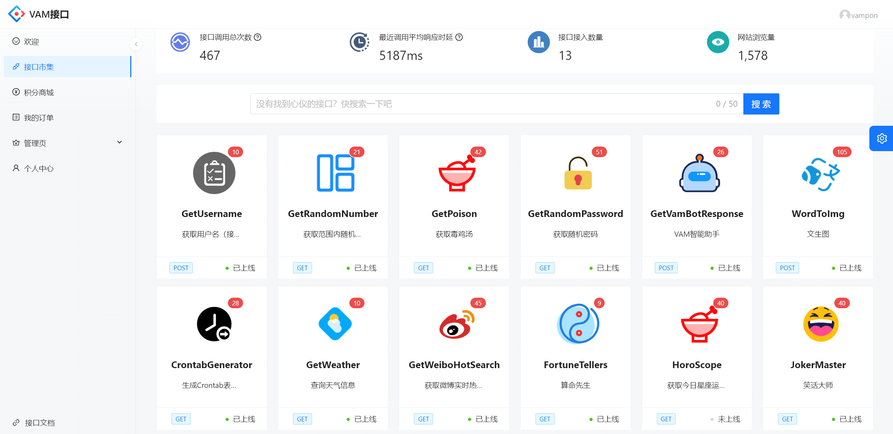
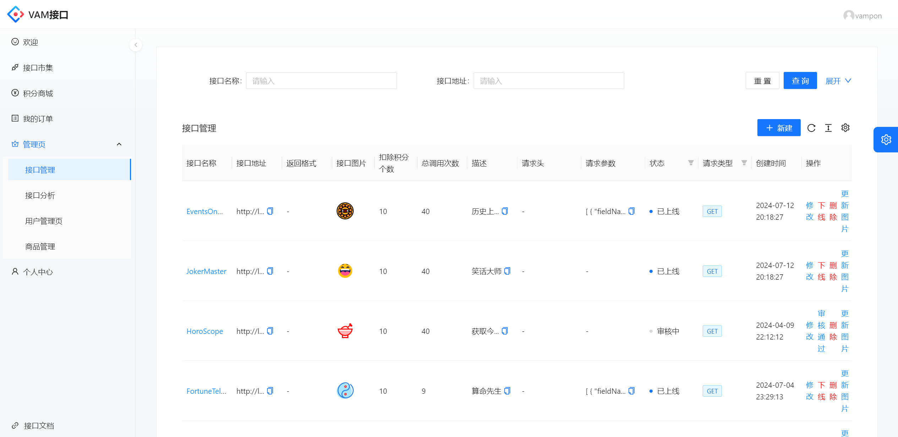
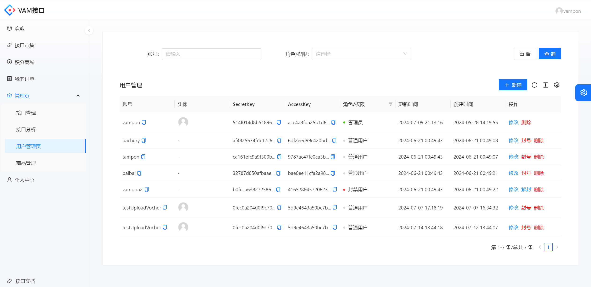
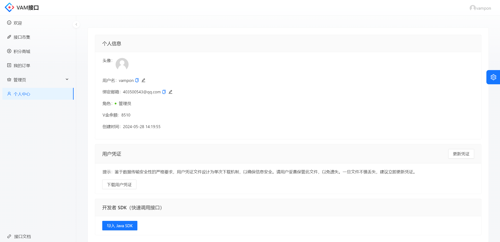
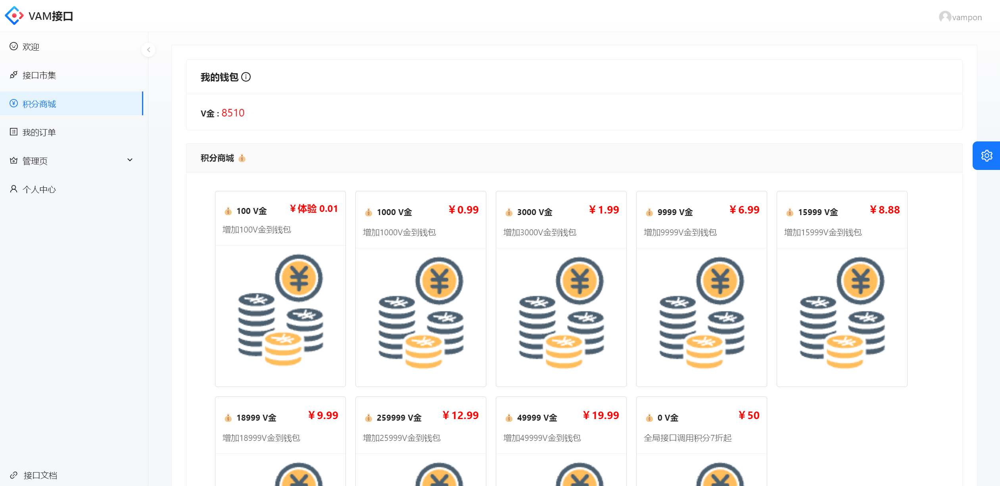
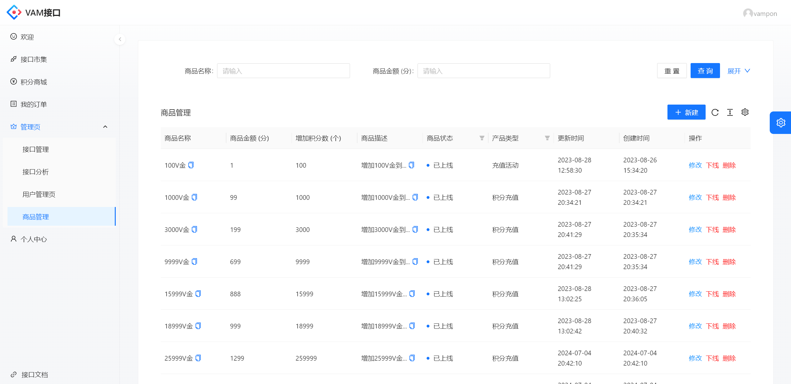

    

<h1 align="center">VAM API 接口开放平台</h1>

<strong>面向开发者的API开放平台 🛠</strong>

    

    

## 项目简介🗺️

VAM API接口开放平台是一个为用户和开发者提供丰富的API接口调用服务的平台

🤝作为『管理员』，可以管理接口和用户，管理接口时可以修改接口信息、上线、添加、发布和修改下线接口。管理用户时可以用户信息、禁用用户和解除用户禁用等。

💻作为『开发者』，可以在线选择所需接口并通过导入[vamapi-client-sdk](https://github.com/Vampon/VAM-API/tree/main/vamapi-client-sdk)快速在项目中集成调用接口的客户端，通过配置客户端的用户资源快速调用接口，减少开发成本，简化开发。

😀作为『用户』，可以查看接口列表，选择感兴趣的接口查看接口文档，在线调用接口，快速查看接口的返回值，判断接口的实现功能。

## 网站导航 🧭

- [**VAM API 后端 🏘️**](https://github.com/Vampon/VAM-API/tree/main/vamapi-backend)
- [**VAM API 前端 🏘**️](https://github.com/Vampon/VAM-API/tree/main/vamapi-frontend-master)
- **[VAM API-SDK](https://github.com/Vampon/VAM-API/tree/main/vamapi-client-sdk)** 🛠
- **[VAM API 接口开放平台 🔗](https://vamapi.cloud/)**
- **[VAM API 开发者文档 📖](https://vampon.github.io/VAM-API-DOC)**

## 目录结构 📑

| 模块                    | 模块说明     |
| ----------------------- | ------------ |
| 🏘️vamapi-backend         | 后端服务模块 |
| 🏘️vamapi-frontend-master | 前端界面     |
| 🕸️vamapi-gateway         | 网关服务模块 |
| 🔗vamapi-interface       | 接口服务模块 |
| 🛠vamapi-client-sdk      | 开发者SDK    |

## 系统架构📋

## 技术选型 🎯

## 后端

- SpringBoot
- SpringCloud-Gateway
- Dubbo
- Maven
- Nacos
- MySQL
- Lombok
- Junit
- Mybatis-plus
- Hutool
- Redis
- Redisson
- commons-email
- 微信支付
- 文心一言

## 前端

- Ant Design Pro Umi
- AntV
- React
- Umi
- axios
- VuePress
- Hexo

## 功能介绍 📋

| **功能**                                                     | **普通用户** | **管理员** |
| ------------------------------------------------------------ | ------------ | ---------- |
| 多语言版本SDK快速接入                                        | ✅            | ✅          |
| **[开发者API在线文档](https://vampon.github.io/VAM-API-DOC)** | ✅            | ✅          |
| 在线调试接口                                                 | ✅            | ✅          |
| 每日签到得V币                                                | ✅            | ✅          |
| 接口大厅搜索接口、浏览接口                                   | ✅            | ✅          |
| 邮箱验证码登录注册                                           | ✅            | ✅          |
| API密钥生成/下载/更新                                        | ✅            | ✅          |
| 更新头像                                                     | ✅            | ✅          |
| 绑定、换绑、解绑邮箱                                         | ✅            | ✅          |
| 订单/充值活动管理                                            | ❌            | ✅          |
| 用户管理、封号解封等                                         | ❌            | ✅          |
| 接口管理、接口发布审核、下架                                 | ❌            | ✅          |
| 统计数据智能BI分析                                           | ❌            | ✅          |

## 功能展示🎯

### 接口页面

### 接口详细界面

### 接口信息智能BI统计分析

.png)

.png)

### 接口管理

### 用户管理

### 个人信息

### 积分商城界面与活动管理

### 登录

