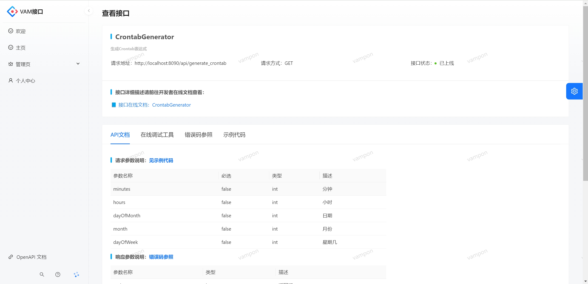

# VAM- API 开放平台

## 项目简介

VAMAPI接口开放平台是一个为用户和开发者提供丰富的API接口调用服务的平台

🤝作为『管理员』，可以管理接口和用户，管理接口时可以修改接口信息、上线、添加、发布和修改下线接口。管理用户时可以用户信息、禁用用户和解除用户禁用等。

💻作为『开发者』，可以在线选择所需接口并通过导入[vamapi-client-sdk](https://github.com/Vampon/VAM-API/tree/main/vamapi-client-sdk)快速在项目中集成调用接口的客户端，通过配置客户端的用户资源快速调用接口，减少开发成本，简化开发。

😀作为『用户』，可以查看接口列表，选择感兴趣的接口查看接口文档，在线调用接口，快速查看接口的返回值，判断接口的实现功能。

## 目录结构 

| 模块                   | 模块说明     |
| ---------------------- | ------------ |
| vamapi-backend         | 后端服务模块 |
| vamapi-frontend-master | 前端界面     |
| vamapi-gateway         | 网关服务模块 |
| vamapi-interface       | 接口服务模块 |
| vamapi-client-sdk      | 开发者SDK    |

## 项目流程

## 功能展示

### 接口页面

### 接口详细界面

#### 

### 接口管理

### 用户管理

### 个人信息

### 登录

